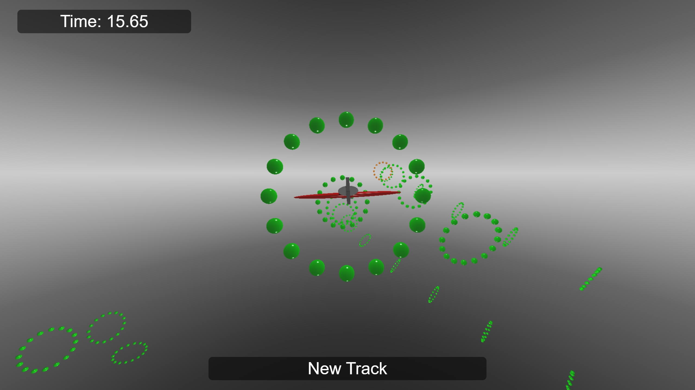
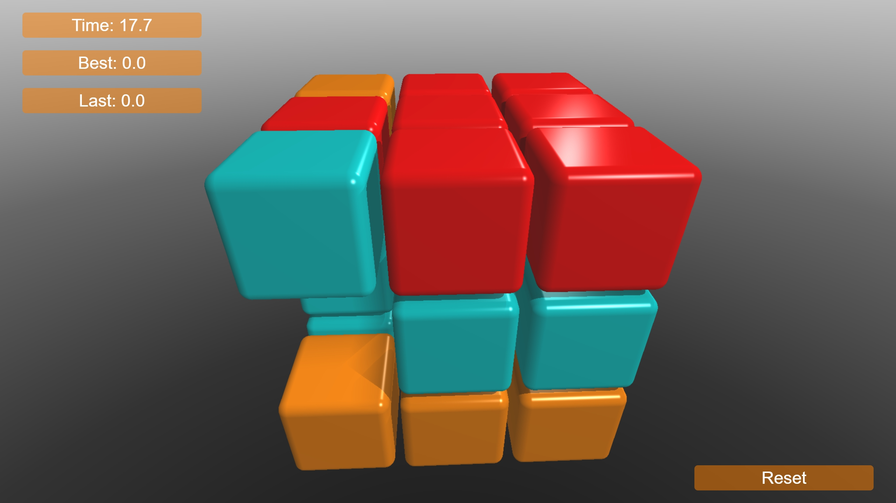
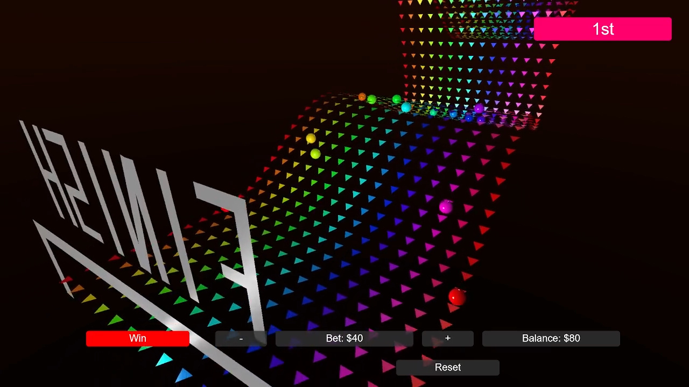

A collection of projects that can be directly run in the Vibe2Game.com engine by copy-pasting.

These are meant to be used for AI-prompting-based (zero coding) game development. You can use them as a starting point to create your own games/demos by simply chatting with your favorite chatbot or AI assistant.

Along with the .c source listing, a .png version of the same is also provided. These .png files are source code that can be loaded into the Vibe2Game engine with the 'LOAD' button (an alternative to copying/pasting the text-based source code).

-------------
Game projects
-------------

ShapeAssault-vibe2game.c - latest version of a rail shooter game 

StarTrader-vibe2game.c - latest version of a space game

VertigoWings-vibe2game.c - latest version of a stunt plane game

SlidingPuzzle3D-vibe2game.c - latest version of a puzzle game

TurboTracks-vibe2game.c - latest version of a puzzle game

--------------
Game templates
--------------

ShapeAssault-vibe2game.c - basic elements of a rail shooter game

MemoryGame-template-vibe2game.c - basic memory game

--------------------
Source code examples
--------------------

PathFollowing-SmoothFollowCamera-example-vibe2game.c - sample project demonstrating an actor following a spline-based path and a camera smoothly following the actor while taking it

