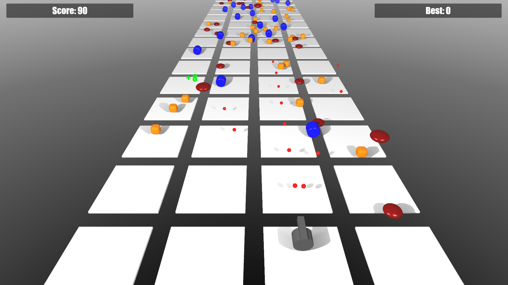
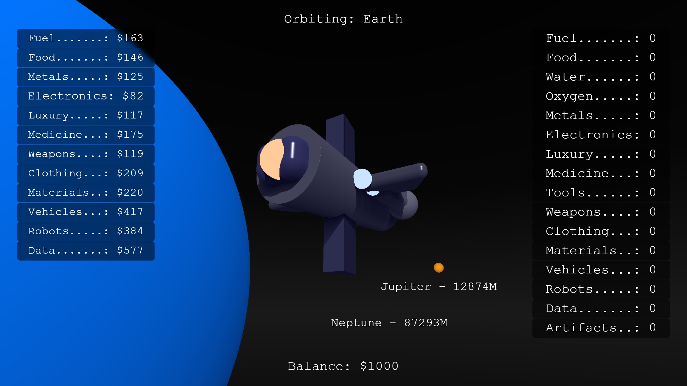

A collection of projects that can be directly run in the Vibe2Game.com engine by copy-pasting.

These are being developed solely via AI-prompting (zero coding). You can use them as starting point to create your own games/demos by simply chatting with your favorite chatbot or AI assistant.

The .png version of each file is the source code in .png format (can be loaded into the Vibe2Game engine with the 'LOAD' button).

-------------
Game projects
-------------

ShapeAssault-vibe2game.c - latest version of a rail shooter game 

StarTrader-vibe2game.c - latest version of a space game

--------------
Game templates
--------------

ShapeAssault-vibe2game.c - basic elements of a rail shooter game
MemoryGame-template-vibe2game.c - basic memory game
